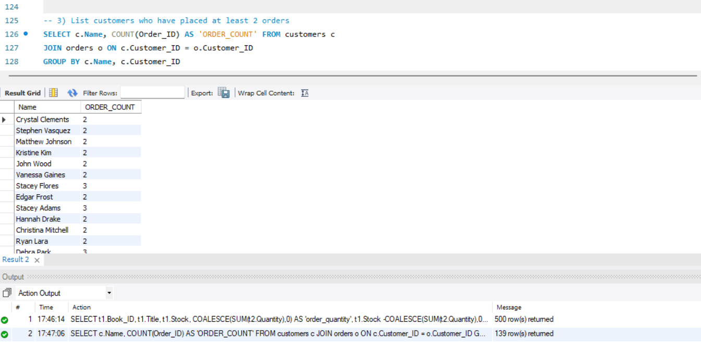
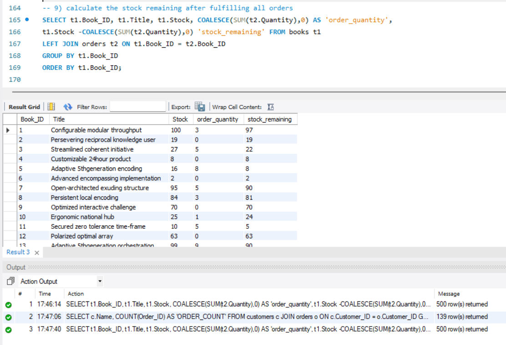
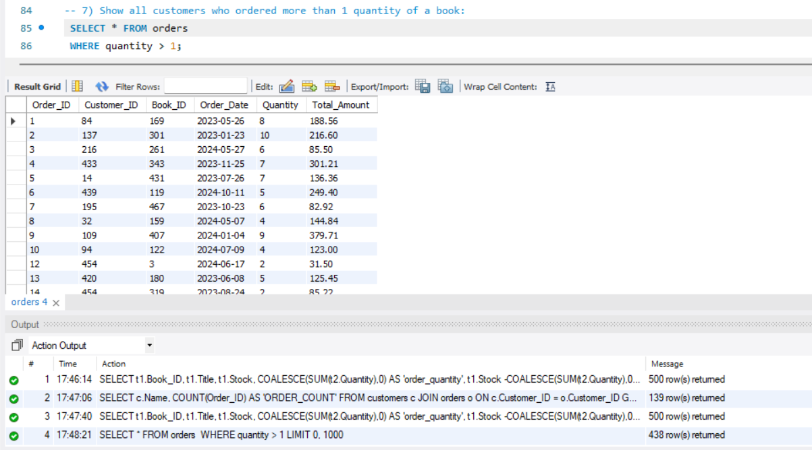
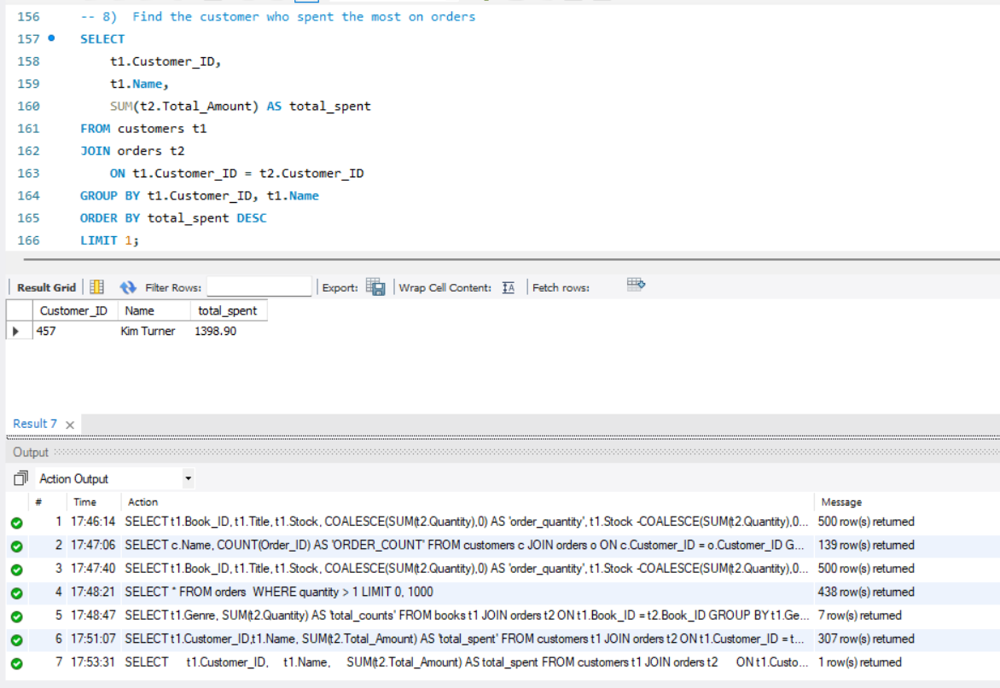

# Online Bookstore SQL Project

A beginner-to-intermediate SQL portfolio project built around an **Online Bookstore** database using **MySQL**. The project demonstrates relational database design, data loading, filtering, aggregation, joins, grouping, sorting, `HAVING`, and business-oriented SQL analysis.

## Project Overview

The database contains three related tables:

- **Books** — book title, author, genre, publication year, price, and stock.
- **Customers** — customer name, email, phone, city, and country.
- **Orders** — customer orders including book, date, quantity, and total amount.

The supplied dataset contains:

- **500 books**
- **500 customers**
- **500 orders**

## Database Relationship

```text
Customers
   |
   | Customer_ID
   v
 Orders
   ^
   | Book_ID
   |
 Books
```

- `Customers.Customer_ID` → `Orders.Customer_ID`
- `Books.Book_ID` → `Orders.Book_ID`

## Technologies Used

- **MySQL**
- **SQL**
- **MySQL Workbench**
- **CSV**

## Repository Structure

```text
online-bookstore-sql-project/
│
├── data/
│   ├── Books.csv
│   ├── Customers.csv
│   └── Orders.csv
│
├── screenshots/
│   └── query-results/
│       ├── 01_customers_with_multiple_orders.png
│       ├── 02_stock_remaining.png
│       ├── 03_orders_quantity_greater_than_one.png
│       └── 04_top_spending_customer.png
│
├── sql/
│   ├── 01_database_setup.sql
│   ├── 02_data_import.sql
│   ├── 03_basic_queries.sql
│   └── 04_advanced_queries.sql
│
├── .gitignore
├── LICENSE
└── README.md
```

## SQL Concepts Demonstrated

This project covers:

- `CREATE DATABASE`
- `CREATE TABLE`
- Primary Keys
- Foreign Keys
- `SELECT`
- `WHERE`
- `BETWEEN`
- `DISTINCT`
- `ORDER BY`
- `LIMIT`
- Aggregate functions:
  - `SUM()`
  - `AVG()`
  - `COUNT()`
- `GROUP BY`
- `HAVING`
- `INNER JOIN`
- `LEFT JOIN`
- `COALESCE()`
- Relational data analysis
- Business-oriented SQL queries

## Queries Solved

### Basic SQL Queries

The project includes queries to:

1. Retrieve books from the Fiction genre.
2. Find books published after 1950.
3. List customers from Canada.
4. Show orders placed in November 2023.
5. Calculate total available book stock.
6. Find the most expensive book.
7. Find orders where quantity is greater than 1.
8. Find orders with total amount greater than 20.
9. List available book genres.
10. Find the book with the lowest stock.
11. Calculate total revenue from all orders.

### Advanced SQL Queries

The project also includes queries to:

1. Calculate the total number of books sold for each genre.
2. Calculate the average price of Fantasy books.
3. Find customers who placed at least two orders.
4. Find the most frequently ordered book.
5. Find the top three most expensive Fantasy books.
6. Calculate the total quantity of books sold by each author.
7. Find cities containing customers whose order amount exceeds 30.
8. Find the customer who spent the most on orders.
9. Calculate remaining stock after fulfilling orders.

## Example Analysis

### Customers With Multiple Orders

```sql
SELECT
    c.Name,
    COUNT(o.Order_ID) AS order_count
FROM Customers c
JOIN Orders o
    ON c.Customer_ID = o.Customer_ID
GROUP BY c.Customer_ID, c.Name
HAVING COUNT(o.Order_ID) >= 2;
```

### Top-Spending Customer

```sql
SELECT
    c.Customer_ID,
    c.Name,
    SUM(o.Total_Amount) AS total_spent
FROM Customers c
JOIN Orders o
    ON c.Customer_ID = o.Customer_ID
GROUP BY c.Customer_ID, c.Name
ORDER BY total_spent DESC
LIMIT 1;
```

### Remaining Stock

```sql
SELECT
    b.Book_ID,
    b.Title,
    b.Stock,
    COALESCE(SUM(o.Quantity), 0) AS order_quantity,
    b.Stock - COALESCE(SUM(o.Quantity), 0) AS stock_remaining
FROM Books b
LEFT JOIN Orders o
    ON b.Book_ID = o.Book_ID
GROUP BY b.Book_ID, b.Title, b.Stock
ORDER BY b.Book_ID;
```

## Query Result Screenshots

### Customers With Multiple Orders



### Remaining Stock



### Orders With Quantity Greater Than One



### Top-Spending Customer



## How to Run the Project

### 1. Clone the repository

```bash
git clone https://github.com/PrajwalMali07/online-bookstore-sql-project.git
cd online-bookstore-sql-project
```

### 2. Open MySQL Workbench

Make sure your MySQL server is running.

### 3. Create the database and tables

Open:

```text
sql/01_database_setup.sql
```

Run the script.

### 4. Import the CSV data

Open:

```text
sql/02_data_import.sql
```

Follow the import commands/instructions in the file to load:

- `data/Books.csv`
- `data/Customers.csv`
- `data/Orders.csv`

### 5. Run the basic queries

Open:

```text
sql/03_basic_queries.sql
```

Execute the queries individually to inspect the results.

### 6. Run the advanced queries

Open:

```text
sql/04_advanced_queries.sql
```

Execute the advanced analysis queries.

## Project Outcomes

This project demonstrates practical SQL skills for working with a small relational business dataset, including:

- Retrieving and filtering records
- Summarizing data with aggregate functions
- Grouping data by business dimensions
- Combining related tables with joins
- Filtering grouped results using `HAVING`
- Analyzing customer purchasing behavior
- Analyzing book sales and inventory
- Calculating revenue and spending
- Using SQL to answer business questions

## Author

**Prajwal Mali**

B.Tech — Artificial Intelligence & Data Science

---

If you find this project useful, feel free to ⭐ the repository.
